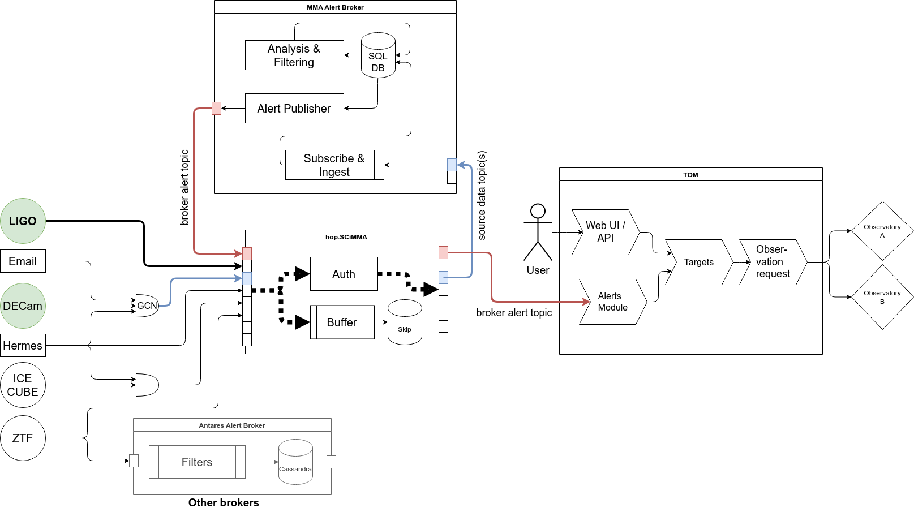
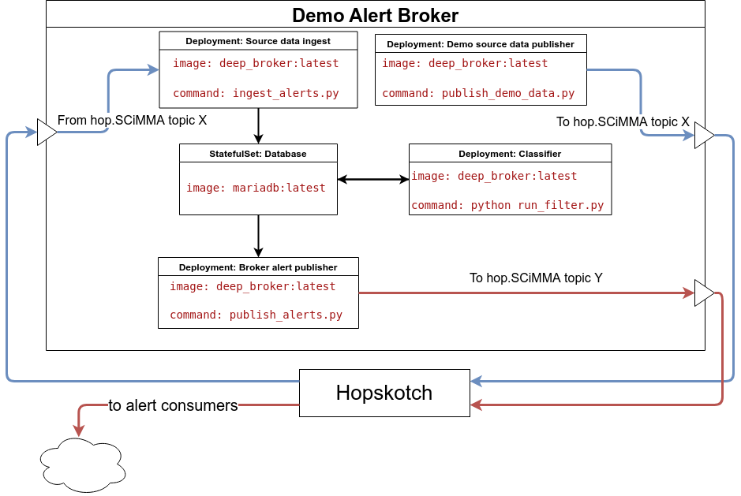

# SCiMMA Alert Integration Demo

## Description

This repo contains the source code and deployment configuration for a prototype system designed for an end-to-end demonstration that will:

1. Subscribe to a Hopskotch topic to receive alerts simulating input from MMA data sources (e.g. GCN, LIGO, ICECUBE, ZTF).
1. Archive the incoming alerts in a database.
1. Analyze incoming alerts using processing pipelines that generate derived alerts.
1. Publish derived alerts to a dedicated Hopskotch topic.
1. Create a TOM based on the TOM Toolkit and subscribe to the derived alert Hopskotch topic via a custom alert broker module to generate targets that drive observation requests to an observatory.

## Architecture

### Overview

The hop.SCiMMA service provides a centralized hub for publishing and subscribing to access-controlled alert streams via the Hopskotch protocol. This demo includes two primary components with subcomponents described below.

1. **MMA alert broker**

    The MMA alert broker is comprised of a set of independent services running as containers in Kubernetes Deployments and Jobs. The components are as follows:

    1. **Source data publisher**. To simulate an MMA alert stream coming from an observation instrument, the source data publisher takes data from the historic GW170817 event and publishes it to a Hopskotch `source` topic.
    
    2. **Source alert ingest**. The source alert ingest subscribes to the `source` Hopskotch topic and ingests downloaded alert message into the broker database (DB).
    
    3. **Classifier**. The classifier polls the DB for new source data and runs a processing pipeline on the data to calculate the probability that the incoming photometry data corresponds to a kilonova event. These results are stored in the broker DB in a dedicated table.
    
    4. **Alert publisher**. The alert publisher polls the broker DB results table and generates alert messages that it publishes to a Hopskotch `results` topic. This alert stream is consumed by the TOM.

2. **Targeting and observation monitor (TOM)**

    The TOM is based on the TOM Toolkit framework (see links below). 
    
    1. A custom OIDC authentication was added, utilizing our own Keycloak server backed by the NCSA CILogon service. 
    
    2. A custom alert broker module was developed to define and run alert queries against the demo broker described above.

### Overall architecture diagram

### Broker components diagram

## Repo structure

* `/apps` contains the ArgoCD manifests that drive the top-level deployment. The relevant `Application` manifest will be manually added as an app in the ArgoCD deployment accessible at https://antares.ncsa.illinois.edu/argo-cd/.
* `/charts` contains Helm chart definitions referenced by the ArgoCD applications.
* `/src` contains source code related to the constituent components. Dockerfiles that define container images are stored here.
* `/docs` contains documentation related to this project.

## Links and references

* [SCiMMA public talk with Electromagnetic Counterpart Identification (El-CID) demo Jupyter notebooks](https://cloud.musesframework.io/s/X6N3aHdDr3tq3zX)
* [El-CID: A filter for Gravitational-wave Electromagnetic Counterpart Identification](https://arxiv.org/abs/2108.04166)
* [TOM Toolkit docs](https://tom-toolkit.readthedocs.io/en/latest/introduction/getting_started.html)
